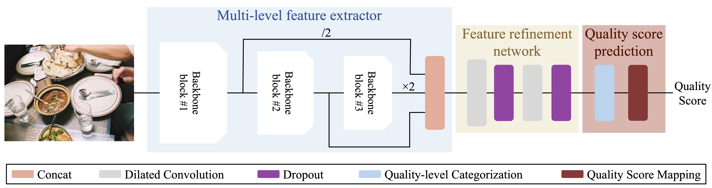

# Blind Image Quality Assessment of Authentically Distorted Images
Code for the paper *Blind Image Quality Assessment of Authentically Distorted Images* (JOSA A).

## Proposed architecture


## Dependencies
* Python 3.8
* [PyTorch](https://pytorch.org/) 1.5.1
* Torchvision
* Cuda 11.4

## Reference
If you have any question, please do not hesitate to contact luigi.celona@unimib.it

If you find this code useful to your research, please consider citing:

* Luigi Celona, and Raimondo Schettini. Blind Image Quality Assessment of Authentically Distorted Images. In _JOSA A_, _volume 39_, _number 4_, pp. -, 2022.
```
@article{celona2022blind,
 author = {Celona, Luigi and Schettini, Raimondo},
 title = {Blind Quality Assessment of Authentically Distorted Images},
 journal = {Journal of the Optical Society of America A},
 volume = {39},
 year = {2022},
 number = {4},
 pages = {-},
 doi = {10.1364/JOSAA.448144}
}
```
